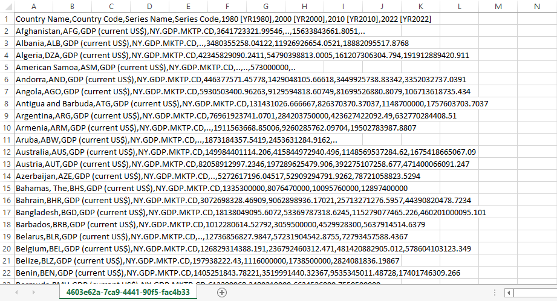
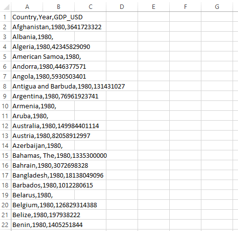

<h2>1. Źródła danych / Data sources: </h2>

https://worldpopulationreview.com
 
https://databank.worldbank.org/source/world-development-indicators

Ze strony worldpopulationreview.com zostały pozyskane dane z ogólnymi informacjami na temat państw świata. Dane na temat populacji dotyczyły tam lat 1980, 2000, 2010, 2022, 2023, 2030 oraz 2050. Na tej podstawie, w celu dalszych analiz ze strony World Bank zostały pobrane dane dotyczące populacji i wskaźników PKB we wspomnianych wcześniej latach z przeszłośći.

Data with general information about was obtained from the worldpopulationreview.com website. The population data there concerned years
1980, 2000, 2010, 2022, 2023, 2030 and 2050. On this basis, the population data and GDP indicators in the previously mentioned past years were downloaded from the World Bank for further analysis.

<h2>2. Różnice między danymi z dwóch źródeł i problemy z tym związane / Differences between data from two different sources and problems because of thet reason:</h2>

Dane ze strony worldpopulationreview.com są od razu gotowe do zaimportowania do bazy danych. W przypadku wszystkich danych z World Bank mamy do czynienia z kilkoma zbędnymi kolumnami i nie pasującą nam ich kolejnością. Konieczna okazała się edycja arkusza danych za pomocą programu Excel.

The data from worldpopulationreview.com are immediately ready to be imported into the database. In the case of all data from World Bank, we are dealing with several unwanted columns, their order does not suit us too. It was necessary to edit the data sheet using Excel.

Dane z worldpopulationreview.com gotowe do zaimportowania do PostgreSQL / Data from worldpopulationreview.com ready to be imported into PostgreSQL:
<picture>
 
</picture>
 
Dane z World Bank wymagające dedycji przed zaimportowaniem do bazy dancyh / Data from World Bank requiring editing before importing into the database:
<picture>
 
</picture>

<h2>3. Przygotowanie danych w programie Excel / Data preparation in Excel:</h2>

Zaimportowane do Excela dane rozbito na poszczególne kolumny, gdzie następnie usunięto zawartość niepotrzebną do dalszych analiz. Na zakończenie uporządkowano dane wierszami w kolejności alfabetycznej i chronologicznej, zachowująć nagłówki.

The data imported into Excel was separated into individual columns, where content unnecessary for further analysis was then removed. Finally, the data was organised in rows in alphabetical and chronological order, leaving the headers.
 
Edytowane dane gotowe do zaimportowania do PostgreSQL / Edited data ready to be imported into PostgreSQL:
<picture>
 
</picture>

<h2>4. Założenie bazy danych w PostgreSQL / Setting up a database in PostgreSQL:</h2>

<a href="https://github.com/ZaPi147/SQL_GDP/blob/main/Database_BazaDanych.sql">Database_BazaDanych</a>

<h2>5. Łączenie danych z dwóch różnych źródeł w PostgreSQL / Joining data from two different sources in PostgreSQL:</h2>

<a href="https://github.com/ZaPi147/SQL_GDP/blob/main/JoiningData_LaczenieDanych.sql">JoiningData_LaczenieDanych</a>

<h2>6. Analiza danych w PostgreSQL / Data analysis in PostgreSQL:</h2>

<a href="https://github.com/ZaPi147/SQL_GDP/blob/main/Queries_zapytania.sql">Queries_zapytania</a>

