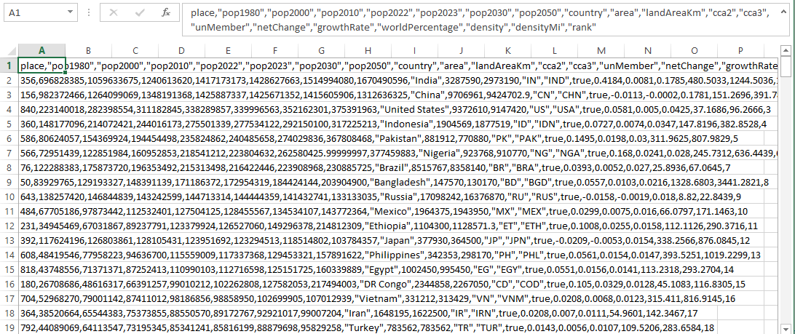

<h2>1. Źródła danych / Data sources: </h2>

https://worldpopulationreview.com/
 
https://databank.worldbank.org/source/world-development-indicators

Ze strony worldpopulationreview.com zostały pozyskane dane z ogólnymi informacjami na temat państw świata. Dane na temat populacji dotyczyły tam lat 1980, 2000, 2010, 2022, 2023, 2030 oraz 2050. Na tej podstawie, w celu dalszych analiz ze strony World Bank zostały pobrane dane dotyczące populacji i wskaźników PKB we wspomnianych wcześniej latach z przeszłośći.

Data with general information about was obtained from the worldpopulationreview.com website. The population data there concerned years
1980, 2000, 2010, 2022, 2023, 2030 and 2050. On this basis, the population data and GDP indicators in the previously mentioned past years were downloaded from the World Bank for further analysis.

<h2>2. Różnice między danymi z dwóch źródeł i problemy z tym związane / Differences between data from two different sources and problems because of thet reason:</h2>

<picture>
 
</picture>
 
<picture>
 
</picture>

pics WPR oraz WB1

Dane ze strony worldpopulationreview.com są od razu gotowe do zaimportowania do bazy danych. W przypadku wszystkich danych z World Bank mamy do czynienia z kilkoma zbędnymi kolumnami i nie pasującą nam ich kolejnością. Konieczna okazała się edycja arkusza nadych za pomocąprogramu Excel.

The data from worldpopulationreview.com are immediately ready to be imported into the database. In the case of all data from World Bank, we are dealing with several unwanted columns, their order does not suit us too. It was necessary to edit the data sheet using Excel.

<h2>3. Przygotowanie danych w programie Excel / Data preparation in Excel:</h2>

